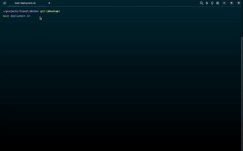

<a href="README.md">
  
</a>

# Travel project 🏖️
<div>
  <a href="https://docs.docker.com/compose/" target="_blank">
    
  </a>
  <a href="https://nginx.org/en/docs/" target="_blank">
    
  </a>
  <a href="https://nodejs.org/en/" target="_blank">
    
  </a>
</div>

### Previous requirements 📝
- Docker Compose **versión 2.x**
- Run bash from the **docker** folder

#### Enabled ports
- [**3001**](http://localhost:3001) for development
- [**4001**](http://localhost:4001) for production

### Options menu 📋
```bash
$ bash deployment.sh
```
```bash
==================
 Travel project 🏖️
==================
1) Deploy on development mode 🛠
2) Delete on development mode 🗑️
3) Deploy on production mode 🚀
4) Delete on production mode 🗑️
5) Quit 👋
Select an option and press Enter 👆: 
```

### Demo 🎬


## Important information 📑
### Image
```bash
$ docker images
```
| REPOSITORY      | TAG                | SIZE   |
| --------------- | ------------------ | ------ |
| node            | 18.14.2-alpine3.17 | ~174MB |
| todolist        | 1.0.0              | ~41MB  |

### Container
```bash
$ docker ps
```
| NAME            | PORTS                  |
| --------------- | ---------------------- |
| todolist        | 0.0.0.0:3002->3000/tcp |
| todolist-prod   | 0.0.0.0:4002->80/tcp   |
