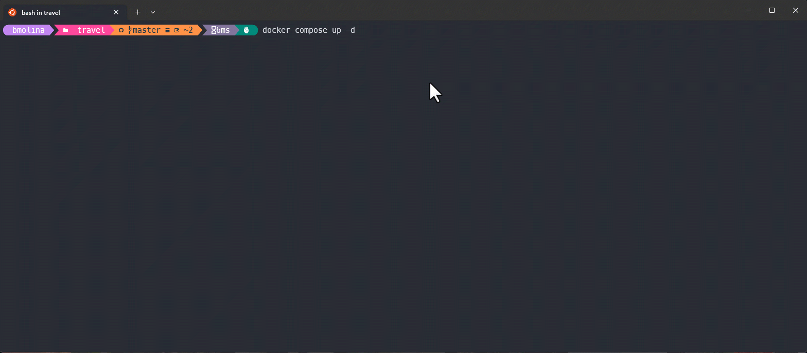
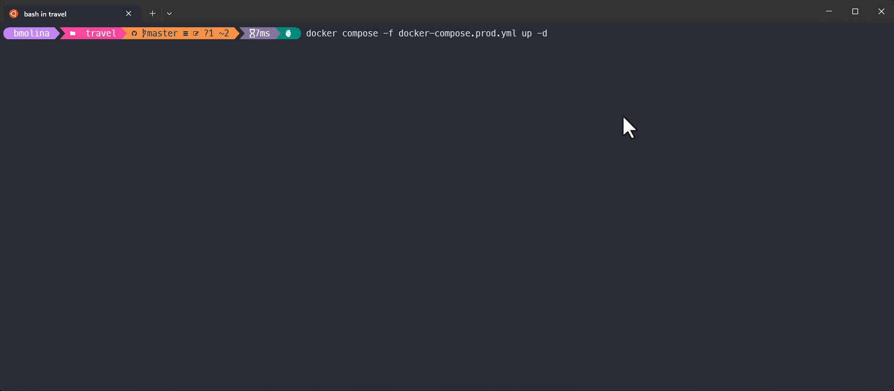

<a href="README.md">
  
</a>

# Proyecto de viajes 🏖️
<div>
  <a href="https://ubuntu.com/wsl" target="_blank">
    
  </a>
  <a href="https://www.docker.com/" target="_blank">
    
  </a>
  <a href="https://docs.docker.com/compose/" target="_blank">
    
  </a>
  <a href="https://nodejs.org/en/" target="_blank">
    
  </a>
  <a href="https://www.npmjs.com/" target="_blank">
    
  </a>
  <a href="https://webpack.js.org/" target="_blank">
    
  </a>
  <a href="https://pages.github.com/" target="_blank">
    
  </a>
  <a href="https://prettier.io/" target="_blank">
    
  </a>
  <a href="https://tailwindcss.com/" target="_blank">
    
  </a>
</div>

### Requisitos previos 📝
- Docker Compose **versión 2.x**
- Ejecutar comandos en **root** del proyecto

#### Variables de entorno
Configurar variables del proyecto en archivo **.env**
```bash
# development
DEV_APP_NAME="travel-app-dev" # Nombre app
DEV_APP_VERSION=1.0.0 # Versión app
DEV_APP_PORT=3000 # Puerto FrontEnd

# production
PROD_APP_NAME="travel-app-prod"
PROD_APP_VERSION=1.0.0
PROD_APP_PORT=3001
```

## Docker Compose 
<!-- ### Construye aplicación en modo desarrollo -->
### Desarrollo
```bash
$ docker compose up -d
```
### Demo 🎬



### Producción
```bash
$ docker compose -f docker-compose.prod.yml up -d
```
### Demo 🎬



## Comandos Docker 


## Información relevante de lo construido
### Imagen
```bash
$ docker images
```
| REPOSITORY     | TAG   | SIZE  |
| -------------- | ----- | ----- |
| travel-app-dev | 1.0.0 | 299MB |

### Volumen
```bash
$ docker volume ls
```
| DRIVER | VOLUME NAME    |
| ------ | -------------- |
| local  | travel-app-dev |

### Red
```bash
$ docker network ls
```
| NAME           | DRIVER | SCOPE |
| -------------- | ------ | ----- |
| travel-app-dev | bridge | local |

### Contenedor
```bash
$ docker compose ps
```
| NAME           | IMAGE                | SERVICE        | PORTS                                     |
| -------------- | -------------------- | -------------- | ----------------------------------------- |
| travel-app-dev | travel-app-dev:1.0.0 | travel-app-dev | 0.0.0.0:3000->8080/tcp, :::3000->8080/tcp |


<!-- 
## Ejecución modo desarollo
```bash
$ npm run dev
```

## Compilación proyecto
```bash
$ npm run build
```

## Link proyecto 🌐
👉 [`URL`](https://bmolina1993.github.io/travel/index.html)

## Demo 🎬


-->
