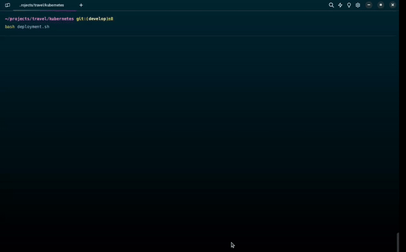

<a href="README.md">
  
</a>

# Travel project 🏖️

### Previous requirements 📝
- [**Microk8s**](https://microk8s.io/docs/getting-started)
- Run bash from the **kubernetes** folder

#### Enabled port
- [**30001**](http://localhost:30001)

#### Options menu 📋
```bash
$ bash deployment.sh
```
```bash
==================
 Travel project 🏖️
==================
1) Deploy service 🚀
2) Delete service 🗑️
3) Port forward website 🌐
5) Quit 👋
Select an option and press Enter 👆: 
```

### Demo 🎬
<!--  -->

## Important information 📑
### Deployment
```bash
$ kubectl get deployment -n web
```
| NAME       | IMAGES                   |
| ---------- | ------------------------ |
| travel     | bgmolina/travel:latest   |

### Service
```bash
$ kubectl get services -n web
```
| NAME           | TYPE     | PORT(S)      |
| -------------- | -------- | ------------ |
| travel-svc     | NodePort | 80:30002/TCP |
